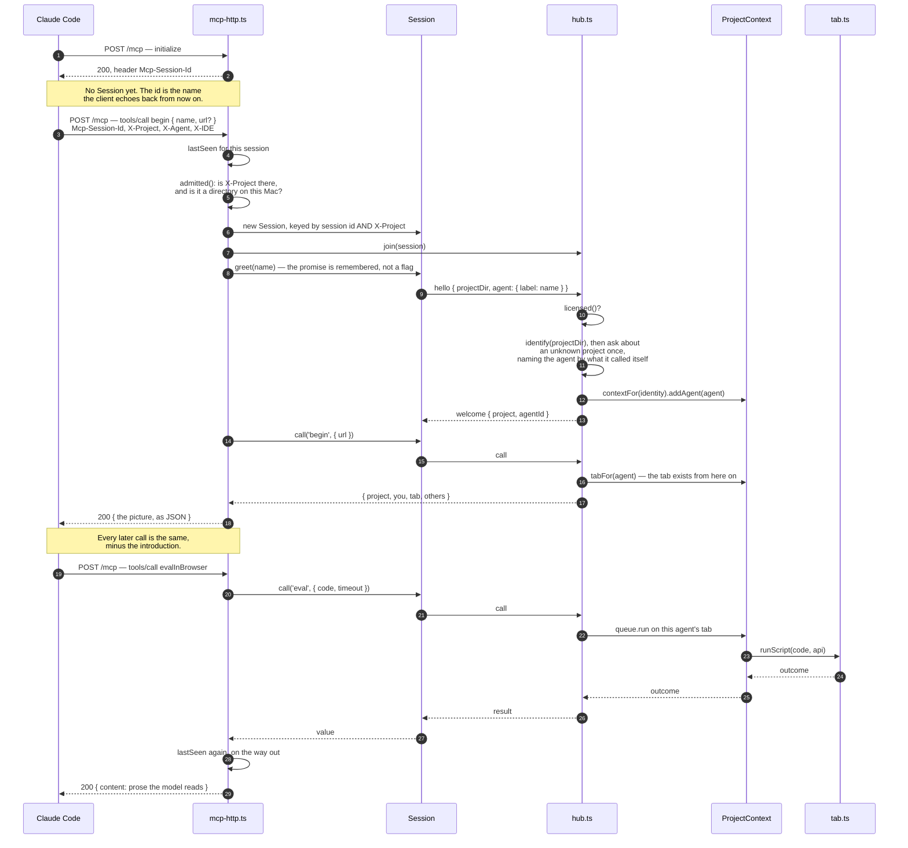
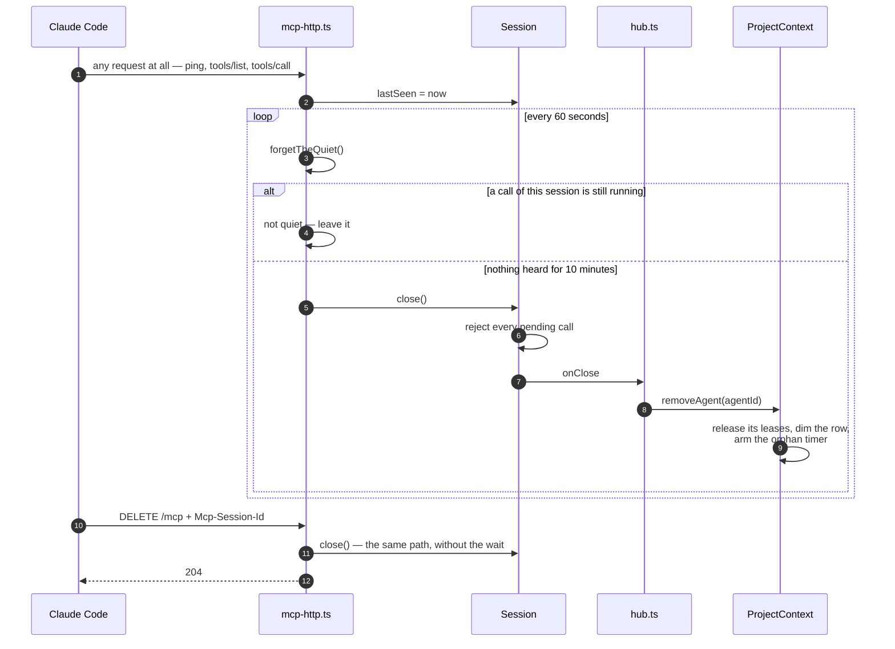
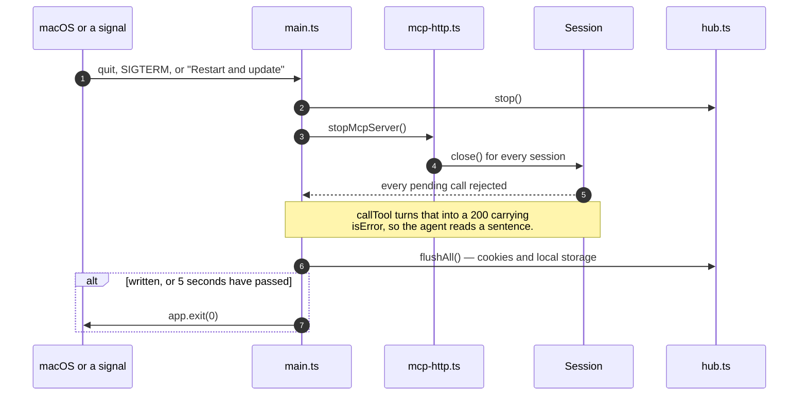
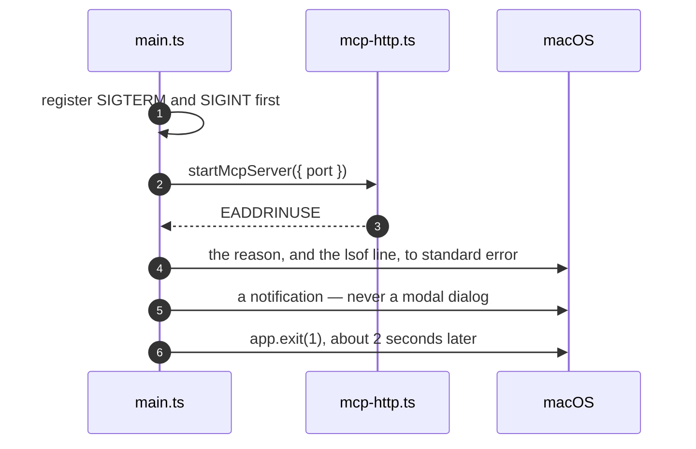

# How a session works

What happens between an agent's first call and the moment its tabs are let go. Written 2026-09-13, for the endpoint that
replaced the relay: the application answers MCP itself, over HTTP on loopback, and every agent is a session inside this
one process.

The files: `src/main/mcp-http.ts` is the endpoint and the sessions, `src/main/hub.ts` admits agents and routes their
calls, `src/main/context.ts` is one project — its window, its tabs, its agents — and `src/main/tab.ts` is one page.

## Connecting, and the first call

A session id is minted at `initialize` and nothing else happens there. The `Session` object appears on the first call
that names a project, and that is also when the hub first hears of the agent.

Later calls skip the middle: `admitted()` finds the session by its key, `greet()` returns the promise it already has,
and the call goes straight to the hub.

## What decides which browser an agent gets

- **The project comes from `X-Project`**, one header per session, expanded by the IDE from one line of configuration.
  `identify()` walks up to the nearest repository root, resolves symlinks and lowercases the result, so two spellings of
  one directory are one project.
- **A session is keyed by the session id and the project together.** A client that keeps one MCP session while its
  working directory changes gets a second session and a second browser, not the first project's cookies.
- **A client that echoes no session id** is keyed by the project, and by `X-Agent` when it sends one — two agents in one
  repository that name themselves stay two agents.
- **A project directory that is not on this Mac is refused** with a sentence in the agent's own hands. An unexpanded
  `${PWD}` is what that usually means.
- **An unknown project is asked about once**, and the answer is kept in `projects.json`. The dialogs are serialised, so
  five agents starting at once in one checkout produce one question.

## Staying alive, and being let go

Nothing is pushed over HTTP and a closing client says nothing, so silence is the only signal there is. Every request
refreshes the session, and a session with a call still running is never swept — asking the person to sign in takes as
long as it takes.

The orphan timer is the settings row "Close a departed agent's tabs after". Its clock starts when Naoba notices the
agent is gone, which for a client that vanished is up to 11 minutes after it did.

## Quitting, and updating

Installing an update quits the application, so quitting is the update's first half. An agent mid-scenario gets a
readable error rather than a hang.

The five seconds are a limit, not a wait: a flush that never settles used to hold the process open, and Squirrel cannot
put the new bundle in place until this process is gone.

## When the port is taken

The port is fixed — 8899 for the copy people download, 8900 for the development copy — because it sits in an IDE's
configuration and has to mean the same thing tomorrow. A second copy of one variant never reaches this code: the
single-instance lock stops it first. So a taken port is somebody else's program.

A modal message box is what this used to do, and it stopped the event loop: the quit underneath it was unreachable and
so was `SIGTERM`, so the only way out of a copy that could not start was to kill it. The asynchronous message box
behaves the same way, which was measured rather than assumed.
